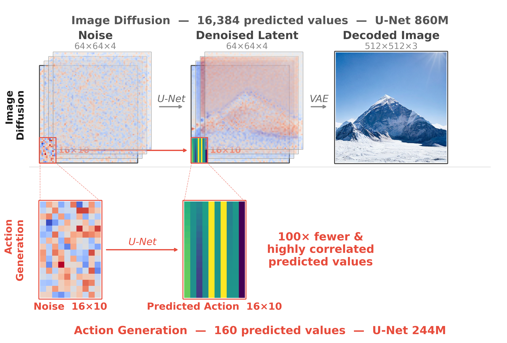
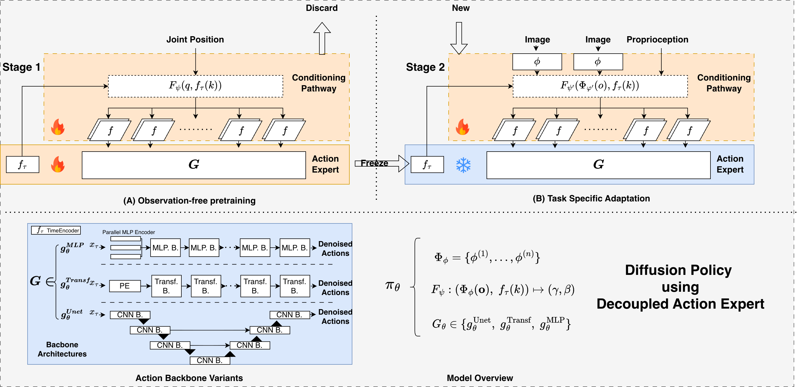

# Decoupled Action Expert

Official codebase for the paper [*"Decoupled Action Expert: Confining Task Knowledge to the Conditioning Pathway"*](https://arxiv.org/abs/2511.12101) (IROS 2026).

## Overview

<p align="center">
  
</p>

Image diffusion models such as Stable Diffusion denoise 16,384 structured latent values, while a manipulation policy generates only 16×10=160 physically correlated action values — of which only a fraction are executed before replanning (8 steps in DP, 5 in π₀). Yet action experts in current VLA designs often adopt similar-scale architectures. This orders-of-magnitude mismatch in output complexity raises a natural question: do these large action backbones actually need their capacity? Where does task-specific knowledge reside — in the backbone or the conditioning pathway?

We propose a **decoupled training recipe** to investigate these questions: pretrain a general-purpose action expert on observation-free forward-kinematics data, then freeze it and adapt to downstream manipulation tasks through the conditioning pathway only.

### Questions We Ask

1. **Where does task knowledge reside — in the backbone or the conditioning pathway?** (IV-A) Our experiments suggest it lives in the conditioning pathway. Freezing the backbone and retraining only the conditioning modules largely preserves performance: DP-C achieves 63.6±1.8% (normal) vs 62.2±2.3% (decoupled) on MimicGen and 79.3±0.6% vs 76.8±0.9% on LIBERO.

2. **Do large action experts need their capacity?** (IV-B) Our experiments indicate they may not. A 5M-parameter MLP (DP-MLP) achieves comparable or better results than the 244M-parameter U-Net (DP-C) on both benchmarks: 65.9±0.7% vs 63.6±1.8% on MimicGen, 84.7±0.5% vs 79.3±0.6% on LIBERO.

3. **Can out-of-distribution data be used for Stage 1 pretraining?** (IV-C) It appears so. DROID pretraining yields gains over in-distribution pretraining (+1.6 on MimicGen, +1.5 on LIBERO) despite complete distribution shift.

4. **What does the backbone actually learn — task-specific knowledge or general trajectory structure?** (IV-D) Our results point toward the latter. Three pretraining variants (joint positions, end-effector poses, no conditioning) achieve comparable results (62.2–63.8%), suggesting the backbone captures general trajectory patterns regardless of pretraining signal.

5. **Which conditioning mechanisms survive backbone freezing?** (IV-E) We compare seven mechanisms on an identical transformer backbone (normal → decoupled):

   | Category | Method | Normal | Decoupled |
   |----------|--------|--------|-----------|
   | Modulation | AdaLN-Zero | 64.0% | 64.5% |
   | Modulation | AdaLN | 62.0% | 62.3% |
   | Modulation | adaRMSNorm | 63.8% | 60.0% |
   | Modulation | FiLM | 59.5% | 51.8% |
   | Modulation | Additive | 57.0% | 45.3% |
   | Token | Cross-Attention | 61.3% | 19.8% |
   | Token | Prefix Tuning | 56.3% | 19.5% |

   The pattern suggests that whether conditioning separates from backbone parameters matters — modulation-based methods stay robust, while token-based methods collapse.

### Method

<p align="center">
  
</p>

- **Stage 1**: Pretrain the action expert on observation-free data (Joint Position → End-Effector Pose) using forward kinematics. The conditioning modules and action backbone are trained together.
- **Stage 2**: Freeze the action backbone, replace conditioning layers, and train only the observation encoders and new conditioning modules on task-specific image data.

### Evaluation Environments

- **MimicGen** (8 tasks): stack, square, coffee, threading, stack_three, hammer_cleanup, three_piece_assembly, mug_cleanup
- **LIBERO** (4 suites): libero_spatial, libero_object, libero_goal, libero_10

## Installation

### Prerequisites

- Linux (tested on Ubuntu 20.04/22.04)
- NVIDIA GPU with CUDA 12.4
- [Miniforge](https://github.com/conda-forge/miniforge) or Miniconda

### Setup

```bash
git clone --recurse-submodules https://github.com/jianzhou0420/DecoupledActionExpert.git
cd DecoupledActionExpert
bash setup.sh                  # Init submodules + apply third-party patches
bash env_install.sh            # Create conda env + install packages
conda activate DecoupledActionExpert
```

## Quick Start

### Debug (Quick Verification)

```bash
# Verify pipeline works (2 epochs)
bash scripts/train/debug_dah_stage1.sh dp_c                    # Stage 1
bash scripts/train/debug_dah_stage2.sh dp_c A <stage1-ckpt>    # Stage 2
bash scripts/train/debug_dah_normal.sh dp_c A                  # Normal (end-to-end)
```

### Training

```bash
# Stage 1: Pretrain action head on observation-free data
bash scripts/train/train_dah_stage1.sh dp_c                    # MimicGen, DP-C
bash scripts/train/train_dah_stage1.sh dp_mlp                  # MimicGen, DP-MLP

# Stage 2: Train vision encoder with frozen action head
bash scripts/train/train_dah_stage2.sh dp_c A <stage1-ckpt>    # MimicGen, per-task
bash scripts/train/train_dah_stage2_droid_dp_libero.sh <stage1-ckpt>  # LIBERO

# Normal (end-to-end baseline)
bash scripts/train/train_dah_normal.sh dp_c A                  # MimicGen, per-task
bash scripts/train/train_droid_dp_libero.sh                    # LIBERO
```

Architecture options: `dp_c` (U-Net, 244M), `dp_t` (Transformer), `dp_t_film` (Transformer+FiLM), `dp_mlp` (MLP, 4M). Task letters: A-H (see `scripts/slurm/IROS/ALL_PAPER_EXP.sh` for mapping).

## Reproducing Paper Experiments

All experiments from the paper are documented in `scripts/slurm/IROS/ALL_PAPER_EXP.sh`. This file is organized by paper section:

| Section | Experiment | Script |
|---------|-----------|--------|
| IV-A | Normal vs Decoupled (DP-C) | `IROS_dp_normal_mimicgen_pertask.sh`, `IROS_dp_stage2_mimicgen_pertask.sh` |
| IV-B | Lightweight backbones (DP-MLP vs DP-C) | Same scripts with `dp_mlp` argument |
| IV-C | DROID pretraining transfer | `IROS_dp_stage2_mimicgen_pertask_droid_pretrain.sh` |
| IV-D | Conditioning source ablation (JP vs eePose vs unconditional vs random frozen) | `IROS_dp_stage2_mimicgen_pertask_ablation_cond_source.sh` |
| IV-E | Conditioning method ablation (7 methods) | `IROS_dp_stage2_mimicgen_pertask_ablation_cond_method.sh` |

Before running SLURM scripts, set `#SBATCH --account=<YOUR_ACCOUNT>` in each script.

## Project Structure

```
DecoupledActionExpert/
├── trainer.py                          # Main training entry point (Hydra + PyTorch Lightning)
├── src/vlaworkspace/
│   ├── policy/                         # Policy implementations (DAH + DROID variants)
│   ├── adaptors/                       # Data transformation (Robot + Model adaptors)
│   ├── dataset/                        # LeRobot dataset loading
│   ├── model/
│   │   ├── DecoupledActionHead/        # Core model components
│   │   │   ├── diffusion/              # Diffusion models (UNet, Transformer, MLP, unified)
│   │   │   ├── vision/                 # Vision encoders (ResNet)
│   │   │   └── common/                 # Normalizers, rotation, utilities
│   │   ├── droid/                      # DROID observation encoder
│   │   └── action_expert/              # Action head implementations
│   ├── env_runner/                     # Evaluation runners (MimicGen, LIBERO)
│   ├── config/                         # Hydra YAML configurations
│   └── z_utils/                        # Utility modules
├── scripts/
│   ├── train/                          # Local training scripts
│   └── slurm/IROS/                     # SLURM scripts for paper experiments
├── assets/                             # Normalization statistics
├── patches/                            # Third-party compatibility patches
├── third_party/                        # Git submodules (lerobot, libero, mimicgen, etc.)
├── environment.yaml                    # Conda environment specification
├── env_install.sh                      # One-command installation
└── setup.sh                            # Submodule init + patch application
```

## Datasets

Training data is hosted on HuggingFace and downloaded automatically:

- **MimicGen**: `JianZhou0420/DAH_mimicgen_<task>_alldemos` (per-task, with images)
- **MimicGen (Stage 1)**: `JianZhou0420/DAH_mimicgen_ABCDEFGH_8tasks_alldemos_lowdim` (all tasks, low-dim only)
- **LIBERO**: `JianZhou0420/libero_<suite>_alldemos_full` (per-suite, with images)
- **LIBERO (Stage 1)**: `JianZhou0420/DAH_libero_all_alldemos_lowdim` (all suites, low-dim only)

## Citation

```bibtex
@article{zhou2025decoupled,
  title={Decoupled Action Expert: Confining Task Knowledge to the Conditioning Pathway},
  author={Zhou, Jian and Lin, Sihao and Fu, Shuai and Li, Zerui and Zhou, Gengze and Wu, Qi},
  journal={arXiv preprint arXiv:2511.12101},
  year={2025}
}
```

## License

This project is released under the [MIT License](LICENSE).

## Acknowledgments

This codebase builds on [LeRobot](https://github.com/huggingface/lerobot), [MimicGen](https://github.com/NVlabs/mimicgen), [LIBERO](https://github.com/Lifelong-Robot-Learning/LIBERO), [robomimic](https://github.com/ARISE-Initiative/robomimic), and [Diffusion Policy](https://github.com/real-stanford/diffusion_policy).
